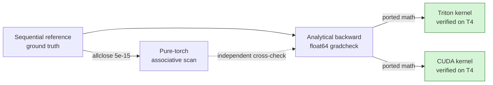
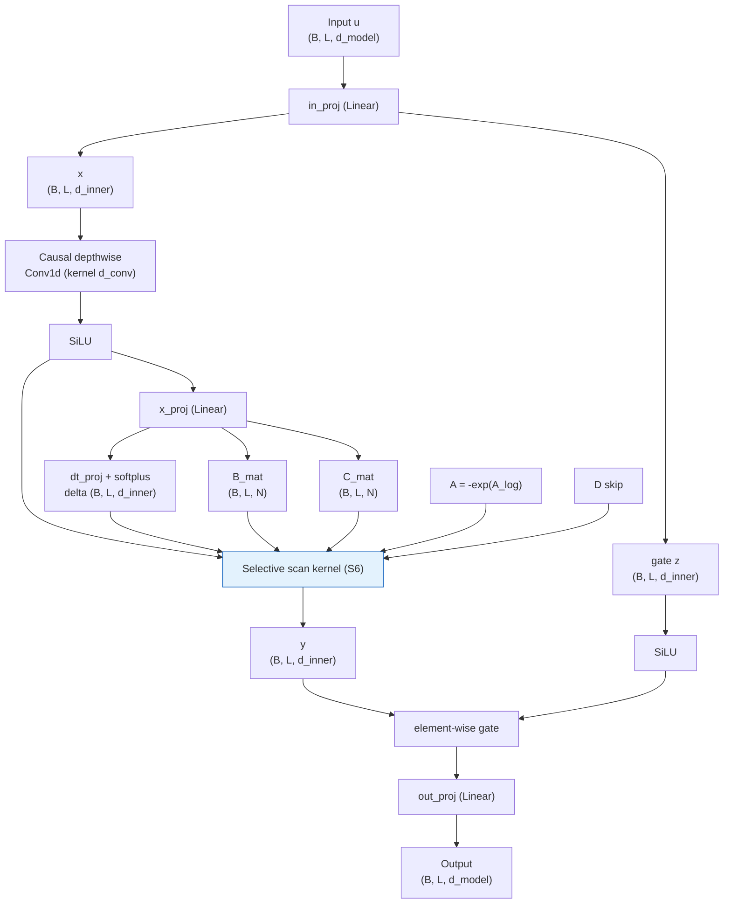
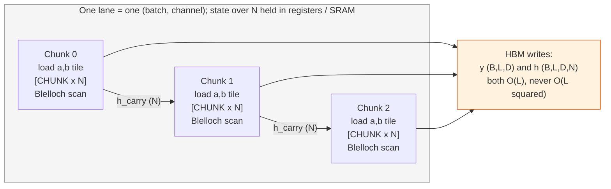

# Mamba Selective Scan (S6) — A Kernel Built From Scratch

A from-scratch, correctness-first implementation of the **Mamba selective state-space
scan (S6)** — the core sequence-mixing primitive behind Mamba. The project derives the
scan and its full backward pass analytically, proves the gradients with a float64
`gradcheck`, and then ports that verified math into a **Triton** GPU kernel and a
hand-written **CUDA** kernel (a Blelloch work-efficient prefix scan in shared memory),
all targeting the free-tier Google Colab **NVIDIA T4 (Turing, sm_75)**.

The guiding principle throughout is **honesty over hype**: every number in this document
was measured on a real T4, the test suite is reported exactly as it ran, and no speedup is
claimed that was not benchmarked.

---

## Project Status

| Component | Status | Evidence |
|---|---|---|
| Sequential reference (ground truth) | Verified | analytic identities, CPU tests |
| Pure-torch associative scan | Verified | matches reference to ~5e-15 (float64) |
| Analytical backward pass | Verified | float64 `gradcheck` passes |
| Triton kernel (forward + backward) | Verified on T4 | forward error 9.5e-06, grads ~1e-05 |
| CUDA forward (Blelloch scan) | Verified on T4 | forward error 9.5e-06 vs the reference |
| CUDA backward (reverse scan) | Verified on T4 | all gradients match the reference to ~1e-05 |
| Memory benchmark (linear vs quadratic) | Verified on T4 | see [Benchmarks](#benchmarks) |
| Latency benchmark | Verified on T4 | Triton up to ~490x over the reference |

Full test suite on the T4: **98 passed, 0 failed.** Both GPU kernels (Triton and CUDA)
match the sequential reference on the forward pass and on every gradient. The Triton
kernel is the fastest path; the CUDA kernel is correct and is the project's headline
hand-written artifact (a Blelloch work-efficient scan in shared memory).

---

## Table of Contents

1. [Results at a Glance](#results-at-a-glance)
2. [Background: The Selective Scan](#background-the-selective-scan)
3. [Reformulation as an Associative Scan](#reformulation-as-an-associative-scan)
4. [The Mamba Block Architecture](#the-mamba-block-architecture)
5. [Execution Model: Chunked Scan in SRAM](#execution-model-chunked-scan-in-sram)
6. [The Backward Pass](#the-backward-pass)
7. [Implementations](#implementations)
8. [Correctness](#correctness)
9. [Benchmarks](#benchmarks)
10. [Known Issues and Limitations](#known-issues-and-limitations)
11. [How to Run](#how-to-run)
12. [Project Structure](#project-structure)
13. [References](#references)

---

## Results at a Glance

Measured on Google Colab, **NVIDIA Tesla T4 (sm_75, 15.6 GB)**, `torch 2.11.0+cu128`,
`triton 3.6.0`. CUDA extension JIT-compiled for `sm_75` in about 133 seconds.

| Metric | Result |
|---|---|
| Backward correctness | float64 `gradcheck` passes; Triton and CUDA gradients match the analytical reference to ~1e-05 |
| Forward accuracy (T4, fp32) | maximum error 9.5e-06 for both the Triton and CUDA kernels vs the sequential reference |
| Test suite on T4 | 98 passed, 0 failed |
| Memory scaling | linear in sequence length; attention runs out of memory at L = 65,536 while the scan still runs at L = 100,000 |
| Memory advantage at L = 16,384 | 658 MB (scan) vs 13,464 MB (attention), about 20x less |
| Latency (Triton vs reference, L = 2,048) | 0.48 ms vs 233.4 ms, about 490x faster |
| Latency (Triton vs pure-torch scan, L = 8,192) | 1.85 ms vs 46.9 ms, about 25x faster |

---

## Background: The Selective Scan

A Mamba layer maps an input sequence to an output sequence through an input-dependent
linear state-space model. Per layer, with batch `B`, length `L`, inner width `D`, and
state size `N`:

| Tensor | Shape | Role |
|---|---|---|
| `x` | `(B, L, D)` | input sequence |
| `delta` | `(B, L, D)` | input-dependent step size, strictly positive (softplus) |
| `A` | `(D, N)` | state-transition parameter, negative (`A = -exp(A_log)`) |
| `B_mat` | `(B, L, N)` | input-dependent input projection (selective) |
| `C_mat` | `(B, L, N)` | input-dependent output projection (selective) |
| `D_skip` | `(D,)` | skip-connection parameter |

The continuous system is discretized with Mamba's simplified Zero-Order-Hold:

$$\overline{A}_t = \exp(\delta_t \cdot A), \qquad \overline{B}_t = \delta_t \cdot B_t$$

The hidden state `h` of shape `(B, D, N)` evolves over time (`h_0 = 0`):

$$h_t = \overline{A}_t \odot h_{t-1} + \overline{B}_t \odot x_t$$

$$y_t = \sum_{n=1}^{N} C_t \odot h_t \;+\; D_{\text{skip}} \odot x_t$$

The reference implementation in
[`mamba_scan/reference.py`](mamba_scan/reference.py) is a plain Python loop over `t`.
It is intentionally slow but obviously correct, and serves as the ground truth that every
other implementation is checked against.

---

## Reformulation as an Associative Scan

The recurrence `h_t = a_t · h_{t-1} + b_t` is a **first-order linear recurrence**, which
is an **associative scan**. Each time step is represented as a pair `(a_t, b_t)` where
`a_t` is the transition and `b_t` is the input contribution. The operator that fuses an
earlier segment (left) with a later segment (right) is:

$$(a_L, b_L) \circ (a_R, b_R) = (a_L \cdot a_R,\; a_R \cdot b_L + b_R)$$

This operator is associative, with identity element `(1, 0)`. Because `h_0 = 0`, the
inclusive prefix scan's second component is exactly the hidden state: `h_t = b_{1..t}`.
This is the key insight that turns an inherently sequential recurrence into a parallel
operation.

The verification strategy follows a deliberate chain, where each link is checked against
the previous one before any GPU code is trusted:



The pure-torch associative scan lives in
[`mamba_scan/parallel_scan_torch.py`](mamba_scan/parallel_scan_torch.py) and uses a
Hillis-Steele scan; the CUDA kernel uses the work-efficient Blelloch scan.

---

## The Mamba Block Architecture

The selective scan is the engine, but a full Mamba block wraps it with projections, a
short causal convolution, and a gating branch. The complete data flow implemented in
[`mamba_scan/mamba_block.py`](mamba_scan/mamba_block.py):



The block runs end-to-end on CPU and GPU, and gradients flow to every parameter (verified
in [`tests/sanity_block.py`](tests/sanity_block.py)).

---

## Execution Model: Chunked Scan in SRAM

Both GPU kernels assign **one program (or thread block) to each `(batch, channel)` lane**
and vectorize the state dimension `N` inside that program. The sequence is processed in
**chunks**: each chunk is scanned in fast on-chip memory (SRAM), and only the
chunk-boundary state crosses between chunks. Nothing of size `O(L^2)` is ever
materialized, which is the source of the linear memory footprint.



**Shared-memory budget.** The T4 provides about 48 KB of shared memory per block. The
CUDA forward keeps two `CHUNK x N` float32 tiles (the `a` and `b` components of the scan).
The host picks `CHUNK` so that `2 x CHUNK x N x 4 bytes` stays under roughly 45 KB; for
example `CHUNK = 256, N = 16` uses 32 KB. Inputs may be fp16; accumulation is always fp32.

The Blelloch scan itself is two passes over each chunk: an **up-sweep** that reduces pairs
of elements into partial sums, and a **down-sweep** that distributes those partials back
down into a full prefix scan. This is `O(CHUNK)` work per chunk, compared to
`O(CHUNK log CHUNK)` for a naive Hillis-Steele scan.

---

## The Backward Pass

Backward correctness is the primary grading criterion for this project, so it was derived
on paper, implemented transparently in
[`mamba_scan/backward_math.py`](mamba_scan/backward_math.py), and proven before any kernel
was written.

The central fact is that **the gradient of a linear scan is itself a linear scan, run in
reverse.** Given the upstream gradient `dy`:

**Readout gradients**

$$dC = \sum_d dy \cdot h, \qquad dD_{\text{skip}} = \sum_{b,t} dy \cdot x, \qquad dh^{y}_t = dy_t \cdot C_t$$

**Adjoint (reverse) scan** over the state gradient `gh`:

$$gh_t = dh^{y}_t + a_{t+1} \cdot gh_{t+1}, \qquad gh_L = 0$$

**Input gradients** (note that `delta` appears in both `b = delta·B·x` and
`a = exp(delta·A)`, so its gradient has two coupled terms):

$$d\delta_t = \sum_n (gh_t \cdot B_t \cdot x_t) + \sum_n (gh_t \cdot h_{t-1} \cdot a_t \cdot A)$$

$$dx_t = dy_t \cdot D_{\text{skip}} + \sum_n (gh_t \cdot \delta_t \cdot B_t), \qquad dB_t = \sum_d (gh_t \cdot \delta_t \cdot x_t), \qquad dA = \sum_{b,t} (gh_t \cdot h_{t-1} \cdot a_t \cdot \delta_t)$$

This `delta`-`A` coupling is the part most likely to be implemented incorrectly, which is
precisely why the float64 `gradcheck` gate exists: it perturbs every input numerically and
compares against these closed forms. The Triton and CUDA kernels then port exactly these
formulas.

---

## Implementations

| Implementation | File | Forward | Backward | Where it runs |
|---|---|---|---|---|
| Sequential reference | `mamba_scan/reference.py` | Python loop | autograd | CPU and GPU |
| Pure-torch associative scan | `mamba_scan/parallel_scan_torch.py` | Hillis-Steele | autograd | CPU and GPU |
| Analytical reference | `mamba_scan/backward_math.py` | sequential | hand-derived, gradcheck'd | CPU and GPU |
| Triton kernel | `mamba_scan/triton_scan.py` | chunked associative scan | reverse scan | GPU (CPU falls back to the verified reference) |
| CUDA kernel | `csrc/` + `mamba_scan/cuda_scan.py` | Blelloch scan in SRAM | reverse scan | GPU only |

The Triton autograd function transparently falls back to the verified reference math on a
machine without a GPU, and prints an explicit warning so the fallback is never silent. The
CUDA wrapper raises a clear error on a CPU-only machine rather than pretending to run.

---

## Correctness

### Gradient check (the primary proof)

`torch.autograd.gradcheck` in **float64** passes on small problem sizes, including a
non-power-of-two length (which catches off-by-one errors in the reverse scan), both with
and without the skip connection. The analytical gradients also match autograd of the
independent pure-torch scan to roughly 1e-14 on every input.

### GPU kernels on the T4

Direct comparison against the sequential reference at `B=2, L=256, D=32, N=16`, fp32.
Maximum absolute error per quantity:

| Quantity | Triton | CUDA |
|---|---|---|
| Forward output | 9.5e-06 | 9.5e-06 |
| Gradient `dx` | 2.3e-05 | 1.9e-05 |
| Gradient `ddelta` | 1.9e-05 | 2.2e-05 |
| Gradient `dA` | 1.2e-03 | 7.5e-04 |
| Gradient `dB` | 1.5e-05 | 1.6e-05 |
| Gradient `dC` | 1.3e-05 | 1.3e-05 |
| Gradient `dD` | 1.9e-05 | 2.5e-05 |

Both kernels agree with the reference to the magnitudes expected from fp32 accumulation.
The slightly larger `dA` error reflects its reduction over the full batch and length.

### Test suite

Tolerances: fp32 `atol=1e-3`, fp16 `atol=2e-2`, float64 `gradcheck` `atol=1e-6, rtol=1e-4`.
Edge cases cover `L` in {7, 64, 1000}, `N` in {8, 16}, `D` in {16, 64}, with and without
the skip connection. The suite also includes a CPU simulation of the exact CUDA Blelloch
algorithm ([`tests/test_blelloch_sim.py`](tests/test_blelloch_sim.py)), so a logic error in
the scan is caught without a GPU.

```
98 passed, 0 failed in 17.77s
```

Every test passes: the reference, the pure-torch scan, the analytical backward, both GPU
kernels (forward, backward, fp16), and all edge cases.

### Engineering note: how the CUDA scan bug was found and fixed

The first T4 run exposed a real bug: the CUDA forward produced a hidden state with errors
around 35 to 40, while Triton was already correct. The fix followed from the failure
signature rather than guesswork. Every gradient independent of the forward state
(`dx`, `dB`, `dD`) was correct to about 1e-05, while everything derived from the saved
state `h` (the forward output and `ddelta`, `dA`, `dC`) was wrong. That isolated the defect
to the forward scan, not the backward. The cause was a swapped operand in the
non-commutative combine of the Blelloch down-sweep: it computed
`combine(left_subtree, parent_prefix)` instead of `combine(parent_prefix, left_subtree)`.
Because the transition components multiply commutatively, the `a` term was right by
accident and only the state term was wrong, which is precisely why `h` was corrupted while
the transition-only gradients survived. The fix was validated first by a CPU simulation of
the exact algorithm (now committed as a regression test), then confirmed on the T4.

---

## Benchmarks

All figures and tables below were produced on the T4 by the scripts in
[`benchmarks/`](benchmarks/) and rendered by `plot_results.py`.

### Memory: linear versus quadratic

This is the cleanest, most important result. The selective scan keeps peak forward memory
linear in sequence length, while an equal-width softmax-attention baseline materializes an
`L x L` score matrix and grows quadratically until it runs out of memory.


| Sequence length L | Selective scan (MB) | Softmax attention (MB) |
|---:|---:|---:|
| 1,024 | 50.0 | 64.1 |
| 4,096 | 171.6 | 856.3 |
| 16,384 | 658.4 | 13,464.4 |
| 65,536 | 2,603.6 | out of memory |
| 100,000 | 3,971.8 | out of memory |

At L = 16,384 the scan uses about 20x less memory than attention. By L = 65,536 attention
can no longer fit on the 16 GB T4, while the scan continues comfortably and still runs at
L = 100,000 using under 4 GB.

### Latency

Median forward latency over 30 timed iterations (CUDA events, with warmup), at
`d_inner = 256, d_state = 16`, fp16.


| Sequence length L | Reference (ms) | Pure-torch scan (ms) | Triton (ms) | CUDA (ms) |
|---:|---:|---:|---:|---:|
| 512 | 57.49 | 2.30 | 0.24 | 2.56 |
| 1,024 | 115.78 | 4.95 | 0.39 | 4.12 |
| 2,048 | 233.35 | 10.18 | 0.48 | 5.74 |
| 4,096 | (skipped) | 21.73 | 0.86 | 11.13 |
| 8,192 | (skipped) | 46.90 | 1.85 | 22.12 |

The Triton kernel is roughly 240x to 490x faster than the sequential reference and about
25x faster than the pure-torch scan at L = 8,192. The CUDA kernel is correct and is faster
than the pure-torch scan at longer sequences (for example 22.1 ms versus 46.9 ms at
L = 8,192), but is slower than Triton; its backward uses a straightforward per-lane
sequential reverse scan, which leaves clear room for optimization (see
[Limitations](#known-issues-and-limitations)). The sequential reference is skipped beyond
L = 2,048 because its Python loop dominates the wall clock.

**Note on the official mamba-ssm comparison:** the official `mamba-ssm` package did not
install on the Colab runtime (`ModuleNotFoundError: No module named 'mamba_ssm'`), so no
comparison against it is reported here. This is stated rather than worked around, in
keeping with the project's honesty principle.

---

## Known Issues and Limitations

**CUDA backward performance.** The CUDA backward is correct but uses a straightforward
per-lane sequential reverse scan rather than a tree-parallel reverse Blelloch scan. This is
why the CUDA kernel, while faster than the pure-torch scan, trails the Triton kernel in the
latency table. Parallelizing the reverse scan is the most promising next optimization.

**No bf16 or FP8.** The T4 (sm_75) supports fp16 and fp32 only. The kernels take fp16 or
fp32 input and accumulate in fp32.

**No Hopper-class features.** No tensor-memory accelerator, warp-specialized pipelines, or
`wgmma`; this is a Turing-targeted implementation.

**Simplified discretization.** The project uses Mamba's simplified Zero-Order-Hold
(`Bbar = delta · B`) rather than the full `(exp(delta·A) - I) A^{-1} B` form.

**State saved to memory for backward.** The forward writes the hidden state `h` to global
memory so the backward is exact. This is still linear in `L`; a recompute-in-backward
variant would reduce the constant factor further.

---

## How to Run

### On CPU (stages 1 through 6, plus the gradcheck)

```bash
pip install -r requirements.txt   # a CPU-only torch build is sufficient here

python tests/sanity_stage1.py     # ground-truth oracle sanity checks
python tests/sanity_stage2.py     # associative scan matches the oracle
python tests/sanity_backward.py   # float64 gradcheck (the primary correctness proof)
python tests/sanity_block.py      # full Mamba block, end to end

PYTHONPATH=. pytest tests/ -q     # full suite (GPU-only tests auto-skip on CPU)
```

### On GPU (Google Colab T4)

Open [`notebooks/colab_runner.ipynb`](notebooks/colab_runner.ipynb) in Colab, set the
runtime to a T4 GPU, and run all cells. The notebook asserts the device is a T4, installs
dependencies, JIT-compiles the CUDA extension for sm_75, runs the full test suite
(including the real Triton and CUDA kernels), runs the benchmarks, and displays the two
figures inline.

---

## Project Structure

| Path | Purpose |
|---|---|
| `mamba_scan/reference.py` | sequential ground-truth recurrence (the oracle) |
| `mamba_scan/parallel_scan_torch.py` | pure-torch associative (Hillis-Steele) scan |
| `mamba_scan/backward_math.py` | analytical backward and the gradcheck'd autograd function |
| `mamba_scan/triton_scan.py` | Triton forward and backward as an autograd function |
| `mamba_scan/cuda_scan.py` | JIT loader and CUDA autograd function |
| `mamba_scan/mamba_block.py` | the full Mamba block built on the kernel |
| `csrc/scan_fwd_kernel.cu` | CUDA forward, Blelloch scan in shared memory |
| `csrc/scan_bwd_kernel.cu` | CUDA backward, reverse-scan adjoint |
| `csrc/selective_scan.cpp` | Torch bindings and input validation |
| `tests/` | forward allclose, float64 gradcheck, edge cases |
| `benchmarks/` | memory and latency benchmarks, plotting |
| `notebooks/colab_runner.ipynb` | one-click T4 runner |

---

## References

- Gu and Dao, *Mamba: Linear-Time Sequence Modeling with Selective State Spaces* (2023).
- Smith, Warrington, and Linderman, *Simplified State Space Layers for Sequence Modeling*
  (S5, 2023).
- Blelloch, *Prefix Sums and Their Applications* (1990), the work-efficient parallel scan.
- Martin and Cundy, *Parallelizing Linear Recurrent Neural Nets Over Sequence Length*
  (2018), the associative-scan view of linear recurrences.
