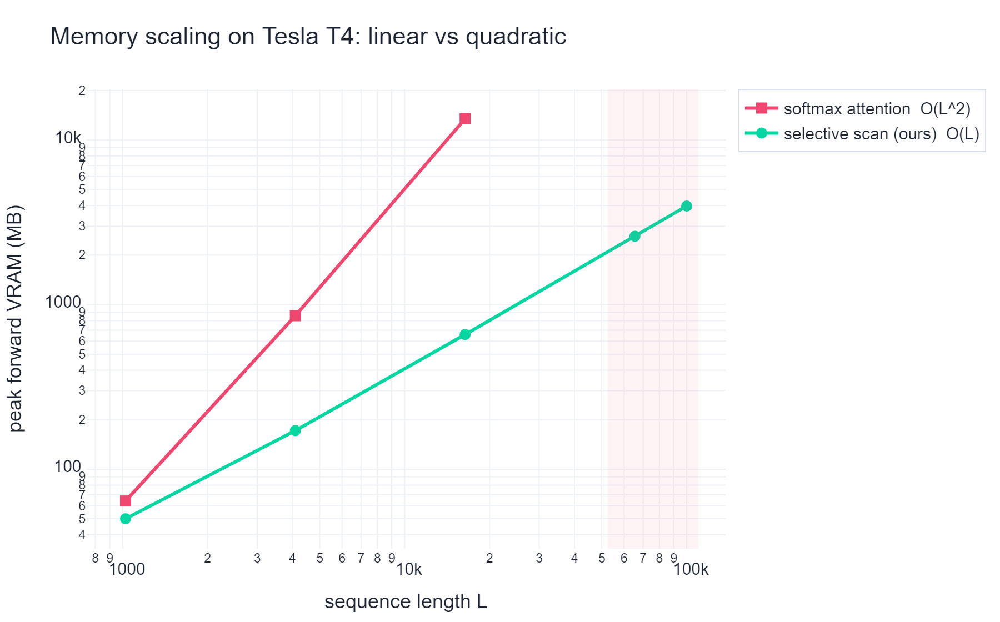
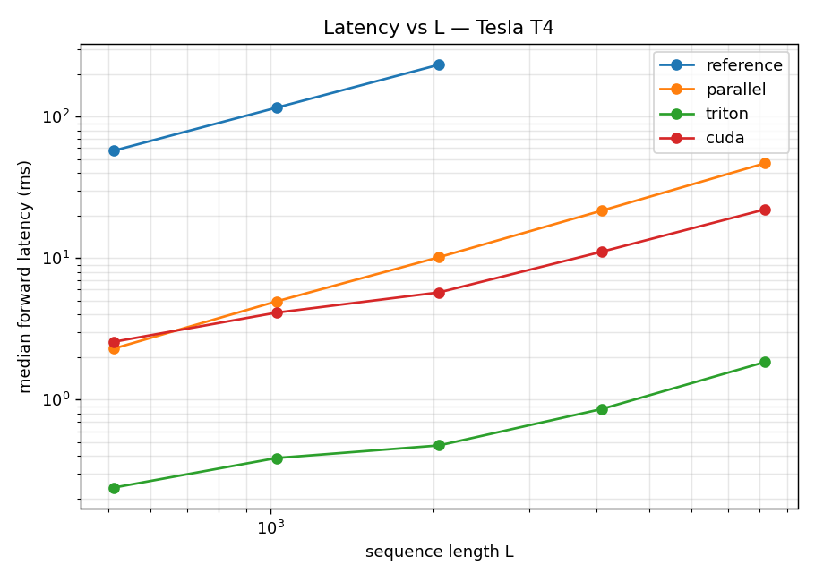

# Mamba selective-scan (S6) kernel — from scratch

A from-scratch implementation of the Mamba selective state-space scan (S6), built
**correctness-first**: the backward pass through the scan is derived analytically and
proven with a float64 `torch.autograd.gradcheck` before any GPU code is written. The
same verified gradient formulas are then ported to a **Triton** kernel and a hand-written
**CUDA** kernel (Blelloch work-efficient prefix scan in shared memory), targeting the
free-tier Colab **T4 (Turing sm_75, fp16/fp32)**.

> **Honest status.** Stages 1–6 (reference, pure-torch associative scan, the analytical
> backward, the test suite, and the full Mamba block) are **verified on CPU** in this
> repo — including the headline float64 gradcheck. The Triton and CUDA kernels are
> authored to port that verified math; they **compile and run on a CUDA device** and are
> validated by the same test suite on a Colab T4 via
> [`notebooks/colab_runner.ipynb`](notebooks/colab_runner.ipynb). No speedup over the
> official `mamba-ssm` is claimed — see [Benchmarks](#benchmarks).

---

## 1. The selective SSM recurrence

Per layer, with `D = d_inner` and state dim `N = d_state`:

```
x      : (B, L, D)     delta : (B, L, D)  > 0  (softplus)
A      : (D, N)        < 0  (A = -exp(A_log))
B_mat  : (B, L, N)     C_mat : (B, L, N)        D_skip : (D,)
```

Discretization (Mamba's simplified Zero-Order-Hold):

```
Abar_t = exp(delta_t[...,None] * A)            # (B, D, N)
Bbar_t = delta_t[...,None] * B_mat_t           # (B, D, N)
```

Recurrence over `t = 1..L` with hidden state `h_t : (B, D, N)`, `h_0 = 0`:

```
h_t = Abar_t ⊙ h_{t-1} + Bbar_t ⊙ x_t[...,None]
y_t = sum_N (C_mat_t ⊙ h_t)        # contract the state dim N
y_t = y_t + D_skip ⊙ x_t           # skip connection
```

The ground-truth sequential implementation is
[`mamba_scan/reference.py`](mamba_scan/reference.py).

## 2. Reformulation as an associative scan

`h_t = a_t · h_{t-1} + b_t` is a **first-order linear recurrence** — an associative scan.
Represent each timestep by the pair `(a_t, b_t)` with `a_t = Abar_t`,
`b_t = Bbar_t · x_t`. The combine operator that fuses an earlier segment **L** into a
later segment **R** is

```
(a_L, b_L) ∘ (a_R, b_R) = (a_L·a_R,  a_R·b_L + b_R)        identity = (1, 0)
```

It is associative (both groupings give the affine map `h ↦ a_L a_R h + a_R b_L + b_R`);
[`tests/sanity_stage2.py`](tests/sanity_stage2.py) checks this numerically. Since
`h_0 = 0`, the **inclusive** prefix scan's `b`-component *is* the state: `h_t = b_{1..t}`.
The pure-torch Hillis–Steele version is
[`mamba_scan/parallel_scan_torch.py`](mamba_scan/parallel_scan_torch.py).

### Blelloch work-efficient scan (CUDA forward)

The CUDA forward ([`csrc/scan_fwd_kernel.cu`](csrc/scan_fwd_kernel.cu)) runs a
**Blelloch** (work-efficient, `O(T)` work, `O(log T)` depth) up-sweep/down-sweep over
each `L`-tile in shared memory, then carries the tile's scan total into the next tile.

### Chunked-scan memory layout (SRAM state carry between chunks)

One block (or Triton program) owns a `(b, d)` lane; the state dim `N` is vectorized.
The sequence is walked in chunks; only the boundary state crosses chunk borders, so
nothing of size `O(L²)` is ever materialized.

```
 lane (b,d), state vector over N held in registers/SRAM
 ──────────────────────────────────────────────────────────────────────
   chunk 0            chunk 1            chunk 2
 ┌───────────┐      ┌───────────┐      ┌───────────┐
 │ a,b tiles │      │ a,b tiles │      │ a,b tiles │     <- loaded to SRAM
 │ [CHUNK×N] │      │ [CHUNK×N] │      │ [CHUNK×N] │
 │  Blelloch │      │  Blelloch │      │  Blelloch │     <- scan in SRAM
 │   scan    │      │   scan    │      │   scan    │
 └─────┬─────┘      └─────┬─────┘      └─────┬─────┘
       │ h_carry (N)      │ h_carry (N)      │
       └───────────▶──────┴───────────▶──────┴────▶ ...  <- only the boundary
                                                            state crosses chunks
 HBM writes: y (B,L,D)  and  h (B,L,D,N, fp32, for backward)   — both O(L), never O(L²)
```

T4 shared-memory budget (~48 KB/block): the forward keeps two `CHUNK×N` fp32 tiles
(`a`, `b`); the host picks `CHUNK` so `2·CHUNK·N·4 B ≤ 45 KB` (e.g. `CHUNK=256, N=16 →
32 KB`). fp16 inputs, fp32 accumulate.

## 3. The backward pass (grading criterion #1)

The adjoint of a linear scan is itself a linear scan. With upstream `dy`:

```
readout:   dC = Σ_d dy·h ,   dD_skip = Σ_{b,t} dy·x ,   dh_y = dy·C
adjoint:   gh_t = dh_y_t + a_{t+1}·gh_{t+1}        (REVERSE scan, gh_L = 0)
locals:    g_bb = gh ,   g_a = gh·h_{t-1}
inputs:    ddelta = Σ_n(g_bb·B·x) + Σ_n(g_a·a·A)        # delta·A coupling: delta enters
           dx     = dy·D_skip + Σ_n(g_bb·delta·B)        #   BOTH bb=delta·B·x and a=exp(delta·A)
           dB     = Σ_d(g_bb·delta·x)
           dA     = Σ_{b,t}(g_a·a·delta)
```

Full derivation and the transparent torch implementation:
[`mamba_scan/backward_math.py`](mamba_scan/backward_math.py). This is the single source
of truth that the Triton and CUDA backward kernels port.

### Correctness (measured on CPU, this repo)

```
float64 gradcheck (B1 L8 D4 N4, +D_skip)   PASSED
float64 gradcheck (B1 L8 D4 N4, no D_skip) PASSED
float64 gradcheck (B2 L7 D3 N5, +D_skip)   PASSED   # non-power-of-2 L
analytical grads vs autograd(parallel scan), max abs err:
   x:5.3e-15  delta:7.1e-15  A:2.0e-14  B:3.6e-15  C:3.6e-15  D:0.0
forward (parallel vs reference): f64 max_err 4.9e-15 ; f32 (L=256) 7.6e-6
```

Tolerances used by the test suite: **fp32 `atol=1e-3`**, **fp16 `atol=2e-2`**, float64
gradcheck `atol=1e-6, rtol=1e-4`. Edge cases exercised
([`tests/test_edge_cases.py`](tests/test_edge_cases.py)): `L ∈ {7, 64, 1000}`,
`N ∈ {8, 16}`, `D ∈ {16, 64}`, with and without `D_skip`. On CPU the suite is
**61 passed, 29 skipped** (the GPU-only tests); on a T4 the 29 run the real kernels.

## 4. Benchmarks

Generated by [`benchmarks/`](benchmarks/) and rendered into
`benchmarks/figures/` by `plot_results.py`. Run them on a T4 (the notebook does this).

**Memory — the clean, real win.** `bench_memory.py` measures peak forward VRAM vs `L`
for our `O(L)`-memory scan against an **equal-width softmax-attention** baseline that
materializes the `(L, L)` score matrix (`O(L²)` memory). The scan stays ~linear while
attention OOMs on the T4 as `L` grows; OOMs are **caught and recorded**, not hidden.



**Latency.** `bench_latency.py` reports tokens/s (CUDA events, warmup, median of 30) for
the sequential reference, the pure-torch scan, our Triton/CUDA kernels, and — *if it
imports on the runtime* — the official `mamba-ssm` (it often needs a matching CUDA
build; if it won't install, the script says so and skips it rather than inventing a
number).



> The committed figures are regenerated by the Colab notebook from the actual run on
> your T4. A CPU smoke run (no VRAM, illustrative only) already shows the parallel scan
> ~1.5–4× faster than the sequential reference.

## 5. Limitations & next steps

- **CUDA backward** uses a *sequential* reverse recurrence per `(b,d)` lane (correct by
  direct transcription of the verified adjoint; parameter grads reduced via `atomicAdd`).
  A fully tree-parallel reverse Blelloch backward is future work. The CUDA **forward** is
  the work-efficient Blelloch scan.
- **No bf16 / FP8** — the T4 (sm_75) supports fp16/fp32 only. fp16 in, fp32 accumulate.
- **No Hopper features** (no TMA, wgmma, warp-specialized pipelines).
- **Simplified ZOH** discretization (`Bbar = delta·B`), as in the Mamba reference, not the
  full `(exp(delta·A) − I) A⁻¹ B` form.
- **`h` saved to HBM** for an exact backward (`O(L·D·N)`, still linear in `L`); a
  recompute-in-backward variant would cut this further.
- No claim of beating `mamba-ssm`; the goal is a correct, legible, honest kernel.

## 6. How to run

```bash
pip install -r requirements.txt           # CPU build is enough for stages 1–6 + gradcheck

# CPU: reference, parallel scan, analytical backward gradcheck, block, edge cases
python tests/sanity_stage1.py             # oracle sanity
python tests/sanity_stage2.py             # associative scan == oracle
python tests/sanity_backward.py           # float64 gradcheck (grading criterion #1)
python tests/sanity_block.py              # full Mamba block end-to-end
PYTHONPATH=. pytest tests/ -q             # full suite (GPU tests auto-skip on CPU)

# GPU (Colab T4): open notebooks/colab_runner.ipynb and Run All
#   -> asserts T4, JIT-compiles csrc/ for sm_75, runs the suite incl. Triton+CUDA,
#      runs benchmarks, shows the two figures inline.
```

### Repo map

| Path | What |
|------|------|
| `mamba_scan/reference.py` | sequential ground-truth recurrence (the oracle) |
| `mamba_scan/parallel_scan_torch.py` | pure-torch associative (Hillis–Steele) scan |
| `mamba_scan/backward_math.py` | analytical backward + `SelectiveScanRef` (gradcheck'd) |
| `mamba_scan/triton_scan.py` | Triton fwd (chunked assoc. scan) + bwd autograd.Function |
| `csrc/scan_fwd_kernel.cu` | CUDA forward — Blelloch scan in shared memory |
| `csrc/scan_bwd_kernel.cu` | CUDA backward — reverse-scan adjoint |
| `mamba_scan/cuda_scan.py` | JIT loader + CUDA autograd.Function |
| `mamba_scan/mamba_block.py` | full Mamba block using the kernel |
| `tests/` | forward allclose, float64 gradcheck, edge cases |
| `benchmarks/` | memory (linear vs quadratic) + latency + plots |
| `notebooks/colab_runner.ipynb` | one-click T4 runner |
